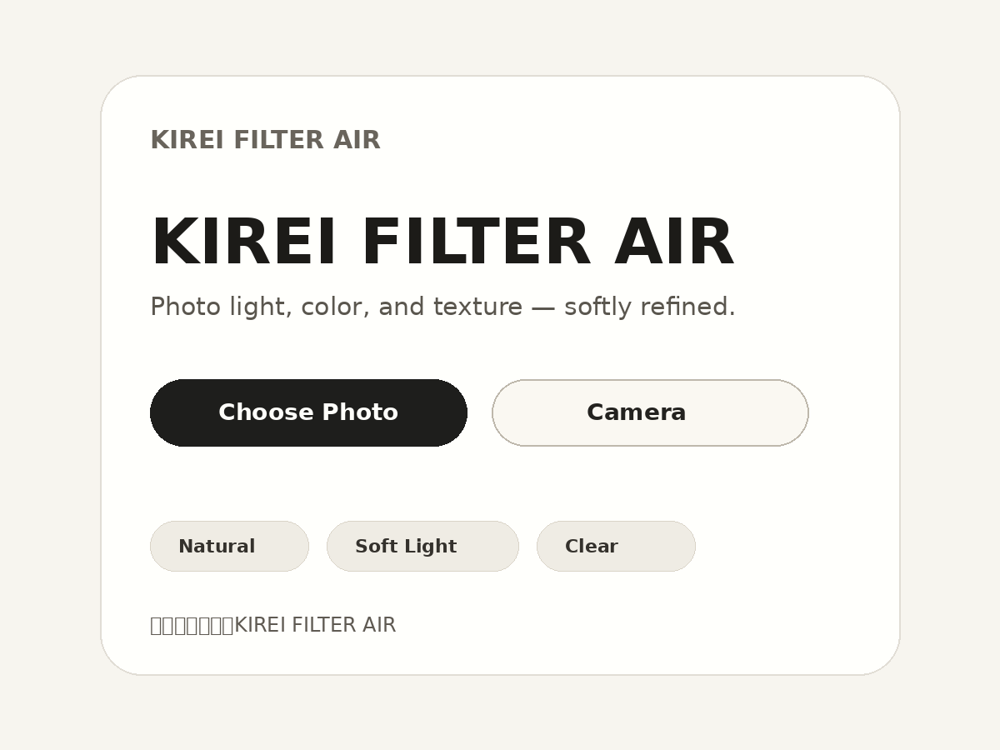

# KIREI FILTER AIR

**キレイに魅せるKIREI FILTER AIR**

写真の光・色・質感を自然に整えるPWAです。  
自分らしさはそのままに、写りの印象をそっと整えます。

## Live Demo

https://ai-kirei-filter-air.pages.dev/

## Screenshot



## Features

- 写真選択 / カメラ撮影
- Natural / Soft Light / Clear
- Before / After 比較
- 目元の自然な微調整
- JPEG保存
- PWA対応

## Concept

KIREI FILTER AIR は、顔を大きく変えるためのアプリではありません。  
写真に写った本人らしさを保ちながら、光・色・質感・写りの印象を自然に整えることを目指しています。

大げさに加工するのではなく、  
「なんか少し写りがいい」くらいの軽さを大切にしています。

## Modes

- **Natural**：元写真に近い自然補正
- **Soft Light**：やわらかい光を足し、少し暖かく見せる
- **Clear**：黒を締め、輪郭を少しシャープに見せる

## Usage

1. 「写真を選ぶ」または「カメラで撮る」を押します。
2. Natural / Soft Light / Clear からモードを選びます。
3. Before / After で仕上がりを確認します。
4. 「保存」でJPEGを書き出します。

## Deploy

```powershell
cd "$env:USERPROFILE\Desktop\kirei-filter-air-v22-restored"
npx wrangler pages deploy . --project-name ai-kirei-filter-air
```

## Notes

このアプリは、写真の印象を自然に整えることを目的としています。  
人物そのものを評価したり、美醜を判定したりするものではありません。
